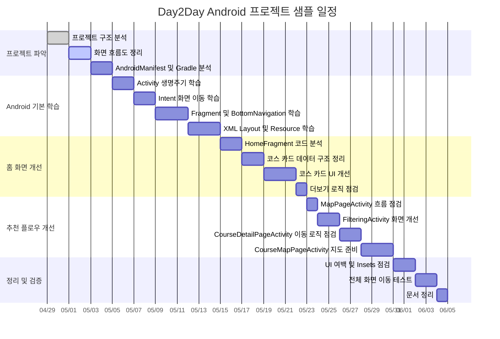

# Day2Day Android 프로젝트 간트차트 샘플

이 문서는 `day2day-android` 프로젝트를 기준으로 만든 샘플 일정표입니다.

기준 시작일은 **2026-04-29**이며, 약 4주 동안 현재 앱 구조를 이해하고 핵심 화면을 개선하는 흐름으로 구성했습니다.

## Mermaid 간트차트

아래 코드는 Mermaid를 지원하는 Markdown 뷰어에서 간트차트로 렌더링됩니다.

## 일정표

| 구분 | 작업 | 시작일 | 종료일 | 기간 | 산출물 |
| --- | --- | --- | --- | --- | --- |
| 프로젝트 파악 | 프로젝트 구조 분석 | 2026-04-29 | 2026-04-30 | 2일 | 패키지 구조 메모 |
| 프로젝트 파악 | 화면 흐름도 정리 | 2026-05-01 | 2026-05-02 | 2일 | Activity, Fragment 흐름도 |
| 프로젝트 파악 | AndroidManifest 및 Gradle 분석 | 2026-05-03 | 2026-05-04 | 2일 | 권한, 시작 화면, 의존성 정리 |
| Android 기본 학습 | Activity 생명주기 학습 | 2026-05-05 | 2026-05-06 | 2일 | Activity별 `onCreate` 역할 정리 |
| Android 기본 학습 | Intent 화면 이동 학습 | 2026-05-07 | 2026-05-08 | 2일 | 화면 이동 경로 표 |
| Android 기본 학습 | Fragment 및 BottomNavigation 학습 | 2026-05-09 | 2026-05-11 | 3일 | MainActivity 탭 전환 구조 정리 |
| Android 기본 학습 | XML Layout 및 Resource 학습 | 2026-05-12 | 2026-05-14 | 3일 | layout, drawable, values 역할 정리 |
| 홈 화면 개선 | HomeFragment 코드 분석 | 2026-05-15 | 2026-05-16 | 2일 | 홈 화면 로직 설명 |
| 홈 화면 개선 | 코스 카드 데이터 구조 정리 | 2026-05-17 | 2026-05-18 | 2일 | `COURSES` 구조 개선안 |
| 홈 화면 개선 | 코스 카드 UI 개선 | 2026-05-19 | 2026-05-21 | 3일 | 카드 UI 수정안 |
| 홈 화면 개선 | 더보기 로직 점검 | 2026-05-22 | 2026-05-22 | 1일 | 페이지 로딩 동작 확인 |
| 추천 플로우 개선 | MapPageActivity 흐름 점검 | 2026-05-23 | 2026-05-23 | 1일 | 추천 시작 화면 점검 |
| 추천 플로우 개선 | FilteringActivity 화면 개선 | 2026-05-24 | 2026-05-25 | 2일 | 필터 화면 개선안 |
| 추천 플로우 개선 | CourseDetailPageActivity 이동 로직 점검 | 2026-05-26 | 2026-05-27 | 2일 | Intent flag 동작 확인 |
| 추천 플로우 개선 | CourseMapPageActivity 지도 준비 | 2026-05-28 | 2026-05-30 | 3일 | Naver Map SDK 연결 점검 |
| 정리 및 검증 | UI 여백 및 Insets 점검 | 2026-05-31 | 2026-06-01 | 2일 | 상태바, 네비게이션바 대응 확인 |
| 정리 및 검증 | 전체 화면 이동 테스트 | 2026-06-02 | 2026-06-03 | 2일 | 화면 이동 테스트 결과 |
| 정리 및 검증 | 문서 정리 | 2026-06-04 | 2026-06-04 | 1일 | 최종 README 또는 학습 문서 |

## 마일스톤

| 마일스톤 | 목표일 | 완료 기준 |
| --- | --- | --- |
| M1. 프로젝트 구조 이해 | 2026-05-04 | Activity, Fragment, XML, Gradle 구조를 설명할 수 있음 |
| M2. Android 기본 화면 흐름 이해 | 2026-05-14 | 앱 실행부터 MainActivity까지 흐름을 설명할 수 있음 |
| M3. 홈 화면 구조 이해 및 개선 | 2026-05-22 | HomeFragment와 코스 카드 생성 방식을 설명하고 수정할 수 있음 |
| M4. 추천 플로우 이해 | 2026-05-30 | 추천 관련 Activity 이동 흐름을 설명할 수 있음 |
| M5. 검증 및 문서화 | 2026-06-04 | 주요 화면 이동 테스트와 문서 정리가 끝남 |

## 작업 우선순위

| 우선순위 | 작업 |
| --- | --- |
| 높음 | Activity, Intent, Fragment 구조 이해 |
| 높음 | HomeFragment와 코스 카드 로직 분석 |
| 중간 | XML layout, drawable, theme 정리 |
| 중간 | 추천 플로우 Activity 이동 로직 점검 |
| 낮음 | Naver Map SDK 세부 기능 구현 |

## 참고 파일

| 영역 | 파일 |
| --- | --- |
| 앱 시작 | `app/src/main/java/com/example/day2day/presentation/splash/SplashActivity.java` |
| 시작 화면 | `app/src/main/java/com/example/day2day/presentation/start/StartActivity.java` |
| 메인 탭 | `app/src/main/java/com/example/day2day/presentation/main/MainActivity.java` |
| 홈 화면 | `app/src/main/java/com/example/day2day/presentation/main/home/HomeFragment.java` |
| 추천 플로우 | `app/src/main/java/com/example/day2day/presentation/recommend/flow/` |
| 공통 Insets | `app/src/main/java/com/example/day2day/presentation/common/NavigationBarInsetHelper.java` |
| 앱 설정 | `app/src/main/AndroidManifest.xml` |
| 빌드 설정 | `app/build.gradle.kts` |
